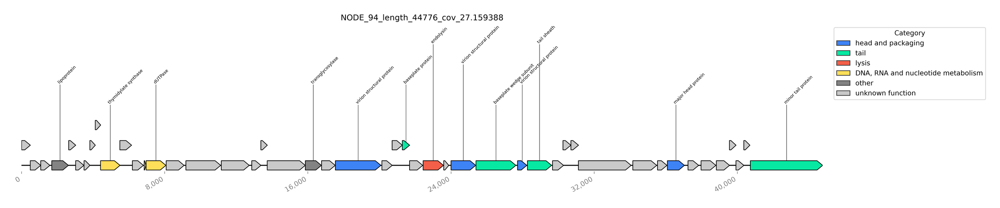
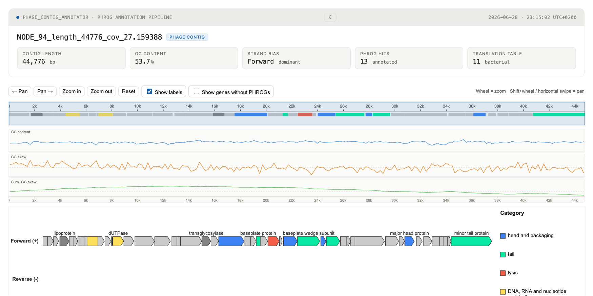

```
█▀▀█ █░░█ █▀▀█ █▀▀▀ █▀▀ 　 █▀▀ █▀▀█ █▀▀▄ ▀▀█▀▀ ░▀░ █▀▀▀ 　 █▀▀█ █▀▀▄ █▀▀▄ █▀▀█ ▀▀█▀▀ █▀▀█ ▀▀█▀▀ █▀▀█ █▀▀█ 
█░░█ █▀▀█ █▄▄█ █░▀█ █▀▀ 　 █░░ █░░█ █░░█ ░░█░░ ▀█▀ █░▀█ 　 █▄▄█ █░░█ █░░█ █░░█ ░░█░░ █▄▄█ ░░█░░ █░░█ █▄▄▀ 
█▀▀▀ ▀░░▀ ▀░░▀ ▀▀▀▀ ▀▀▀ 　 ▀▀▀ ▀▀▀▀ ▀░░▀ ░░▀░░ ▀▀▀ ▀▀▀▀ 　 ▀░░▀ ▀░░▀ ▀░░▀ ▀▀▀▀ ░░▀░░ ▀░░▀ ░░▀░░ ▀▀▀▀ ▀░▀▀
```

Annotates genes on putative phage contigs with a database of hidden Markov models (HMMs) based on [PHROGs](https://phrogs.lmge.uca.fr/). This tool was built to support visual confirmation of predictions made by [Jaeger](https://github.com/Yasas1994/Jaeger).

The pipeline is managed by [Snakemake](https://snakemake.github.io/), uses [pyrodigal-gv](https://github.com/althonos/pyrodigal-gv) for gene calling, [pyhmmer](https://github.com/althonos/pyhmmer) for HMM search, and [tRNAscan-SE](http://lowelab.ucsc.edu/tRNAscan-SE/) for tRNA prediction.

## Requirements

- Python >= 3.11
- Conda (recommended for installing tRNAscan-SE)

## Quick install (macOS/Linux)

If you already have [Conda](https://docs.conda.io/) installed, run:

```bash
bash <(curl -fsSL https://raw.githubusercontent.com/Yasas1994/phage_contig_annotator/main/install.sh)
```

Or, after cloning the repository:

```bash
git clone https://github.com/Yasas1994/phage_contig_annotator.git
cd phage_contig_annotator
bash install.sh
```

## Manual installation

1) Clone the repository:
   ```bash
   git clone https://github.com/Yasas1994/phage_contig_annotator.git
   cd phage_contig_annotator
   ```

2) Create and activate the Conda environment:
   ```bash
   conda env create -f environment.yml
   conda activate phage_contig_annot
   ```

3) Install the package in editable mode:
   ```bash
   pip install -e ".[dev]"
   ```

4) Download the annotation database:
   ```bash
   phage_contig_annotator download-db
   ```

## Usage

Activate the environment and run the full pipeline:

```bash
conda activate phage_contig_annot
phage_contig_annotator run --input test/bin.460.fna --output output_dir --cpus 10
```

By default the pipeline produces a semantically organized output directory:

```
output_dir/
├── annotations/
│   ├── annotations.gff   # annotated contigs in GFF3 format
│   └── annotations.gbk   # annotated contigs in GenBank format
├── genes/
│   ├── proteins.faa      # predicted protein sequences
│   └── proteins.gff      # predicted gene coordinates
├── hmm/
│   ├── hmmsearch.txt     # HMMER-style tblout
│   └── hmmsearch.csv     # parsed HMM hit summary
├── plots/
│   └── *.pdf             # static genome maps (one per contig)
└── trna/
    ├── trna.tsv          # tRNAscan-SE tabular output
    └── trna.gff          # tRNAscan-SE GFF output
```

### Output options

Generate **interactive HTML** plots in addition to PDFs:

```bash
phage_contig_annotator run --input test/bin.460.fna --output output_dir --cpus 10 \
  --plot-format pdf --plot-format html
```

Other plot formats: `pdf` (default), `png`, `html`. Specify `--plot-format` multiple times for multiple formats.

Skip tRNA prediction:

```bash
phage_contig_annotator run --input test/bin.460.fna --output output_dir --cpus 10 --skip-trna
```

Use a dark color theme for plots:

```bash
phage_contig_annotator run --input test/bin.460.fna --output output_dir --cpus 10 --theme dark
```

Run on an existing protein FASTA:

```bash
phage_contig_annotator run --input proteins.faa --output output_dir --type proteins --cpus 10
```

Override the gene-calling translation table (default is auto-selection in metagenomic mode):

```bash
phage_contig_annotator run --input test/bin.460.fna --output output_dir --cpus 10 --translation-table 4
```

Preview the Snakemake execution plan without running:

```bash
phage_contig_annotator run --input test/bin.460.fna --output output_dir --cpus 10 --dry-run
```

## Development

Run the test suite:

```bash
pytest tests/ -v
```

## Examples

A genome map of a contig from the included test data. The figure automatically
switches between the light and dark theme versions when your system/browser
toggles between light and dark modes.

<picture>
  <source media="(prefers-color-scheme: dark)" srcset="docs/images/example_dark.png">
  
</picture>

### Interactive HTML report

Generate an interactive HTML report in addition to (or instead of) static maps:

```bash
phage_contig_annotator run --input test/bin.460.fna --output output_dir \
  --plot-format pdf --plot-format html
```

The HTML report lets you pan and zoom along the contig, toggle gene labels,
show/hide genes without PHROG hits, and switch between light and dark themes.
It also shows GC content, GC skew, and cumulative GC skew tracks.

<picture>
  <source media="(prefers-color-scheme: dark)" srcset="docs/images/html_report_dark.png">
  
</picture>

An example report is included at [docs/examples/NODE_94_report.html](docs/examples/NODE_94_report.html).
Open it locally after cloning, or enable GitHub Pages on the `docs/` folder to
view it directly in a browser.
